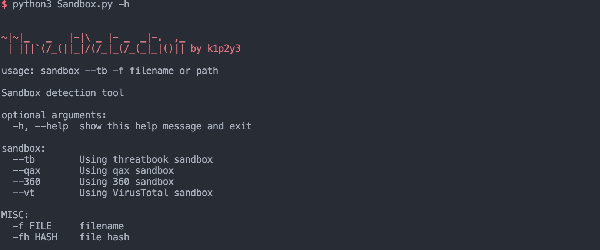

# 沙箱批量检测工具

* 在蓝队HW或巡检时发现，总会有很多的病毒木马需要去跑一跑沙箱，所以写了这个工具，集成多家api沙箱，提高生产力。
* 目前只支持微步，后续会继续更新




## 使用教程
* 在config.py中配置key
```python
python3 Sandbox.py 平台 -f 文件名
```
### 例如使用微步
* 使用微步单个上传检测
```
python3 Sandbox.py -tb -f 文件名
```
* 使用微步批量上传检测
```
python3 Sandbox.py -tb -f ./path
```
## 支持

| 平台 | 是否支持 |
|---|:---:|
| 微步云沙箱 | ✅ |
| 奇安信文件分析 | ❌ |
| 360文件分析 | ❌ |
| Vt文件分析 | ❌ |


